# HySAIF - 企业级敏感信息管理系统

一个现代化的企业级敏感信息管理系统，提供安全的密钥、凭证和敏感数据管理解决方案。

## 📋 目录

- [功能特性](#-功能特性)
- [系统架构](#-系统架构)
- [快速开始](#-快速开始)
- [安装部署](#-安装部署)
- [配置说明](#-配置说明)
- [开发指南](#-开发指南)
- [贡献指南](#-贡献指南)

## 🚀 功能特性

### 🔐 多类型密钥管理
- **密码管理** - 安全存储用户名/密码组合
- **API 密钥** - 管理各种服务的 API 凭证
- **访问密钥** - AWS/阿里云等云服务访问凭证
- **SSH 密钥** - 私钥/公钥对管理
- **令牌管理** - JWT、OAuth 令牌等
- **自定义类型** - 灵活的自定义数据结构

### 🛡️ 企业级安全
- **WebAuthn 认证** - 支持硬件安全密钥和生物识别
- **RBAC 权限控制** - 基于 Casbin 的精细化权限管理
- **访问申请流程** - 完整的审批工作流
- **OpenBao 集成** - 企业级加密引擎
- **多重加密** - AES + Vault 双重加密保护
- **审计日志** - 完整的操作审计跟踪

### 📊 管理功能
- **分类标签** - 灵活的密钥分类和标签系统
- **环境隔离** - 开发/测试/生产环境隔离
- **过期管理** - 自动过期提醒和管理
- **批量操作** - 支持批量导入/导出
- **搜索过滤** - 强大的搜索和过滤功能

### 🔔 通知系统
- **到期提醒** - 智能的密钥到期通知
- **访问申请** - 实时的申请状态通知
- **安全警报** - 异常访问和安全事件通知

## 🏗️ 系统架构

```mermaid
graph TB
    %% 客户端层
    Client[前端应用<br/>Vue.js]
    
    %% API服务层
    subgraph "API服务层 (Go)"
        API[RESTful API<br/>Gin框架]
        Auth[认证中间件<br/>JWT + WebAuthn]
        RBAC[权限控制<br/>Casbin RBAC]
    end
    
    %% 业务逻辑层
    subgraph "业务逻辑层"
        SecretMgr[密钥管理]
        UserMgr[用户管理]
        RequestMgr[访问申请]
        NotifyMgr[通知系统]
    end
    
    %% 数据层
    subgraph "数据存储层"
        DB[(关系数据库<br/>PostgreSQL/MySQL/SQLite)]
        Vault[HashiCorp Vault/OpenBao<br/>企业级加密]
    end
    
    %% 连接关系
    Client --> API
    API --> Auth
    Auth --> RBAC
    RBAC --> SecretMgr
    RBAC --> UserMgr
    RBAC --> RequestMgr
    RBAC --> NotifyMgr
    
    SecretMgr --> Vault
    SecretMgr --> DB
    UserMgr --> DB
    RequestMgr --> DB
    NotifyMgr --> DB
```



## 🚀 快速开始

### 前置要求

- Go 1.24+
- Node.js 18+
- pnpm 9+
- Docker & Docker Compose (可选)

### 使用 Docker Compose (推荐)

```bash
# 克隆项目
git clone https://github.com/akinoccc/hysaif.git
cd hysaif

# 复制环境配置
cp env.example .env

# 启动服务
cd deploy/demo
docker compose up -d
```

### 手动安装

#### 1. 后端设置

```bash
cd api

# 安装依赖
go mod download

# 复制配置文件
cp config.example.json config.json

# 编辑配置文件 (设置数据库连接等)
vim config.json

# 运行后端
go run main.go
```

#### 2. 前端设置

```bash
cd web

# 安装依赖
pnpm install

# 启动开发服务器
pnpm dev

# 构建生产版本
pnpm build
```

## ⚙️ 配置说明

### 后端配置 (config.json)

```json
{
  "database": {
    "type": "postgresql",              // 数据库类型: postgresql, mysql, sqlite
    "host": "localhost",
    "port": 5432,
    "name": "hysaif",
    "user": "hysaif_user",
    "password": "your_password"
  },
  "security": {
    "encryption_key": "32位加密密钥",
    "jwt_secret": "JWT密钥",
    "webauthn": {
      "rp_display_name": "HySAIF",
      "rp_id": "localhost",
      "rp_origins": ["http://localhost:5173"]
    },
    "vault": {
      "enabled": true,                 // 启用 Vault 加密
      "address": "https://vault.example.com:8200",
      "token": "vault-token",
      "key_name": "hysaif-encrypt-key"
    }
  },
  "server": {
    "host": "localhost",
    "port": 50010
  }
}
```

### 环境变量配置

```bash
# 数据库配置
MYSQL_ROOT_PASSWORD=secure_password
MYSQL_DATABASE=hysaif
MYSQL_USER=hysaif
MYSQL_PASSWORD=hysaif_password

# 应用安全配置
SIMS_ENCRYPTION_KEY=32位长度的加密密钥
SIMS_JWT_SECRET=JWT签名密钥

# Vault 配置 (可选)
SIMS_VAULT_ENABLED=true
SIMS_VAULT_ADDRESS=https://vault.example.com:8200
SIMS_VAULT_TOKEN=vault-token
SIMS_VAULT_KEY_NAME=hysaif-encrypt-key
```

### OpenBao/HashiCorp Vault 配置

```bash
# 启用 Transit 引擎
bao secrets enable transit

# 创建加密密钥
bao write transit/keys/hysaif-encrypt-key type=aes256-gcm96

# 创建策略
bao policy write hysaif-policy - <<EOF
path "transit/encrypt/hysaif-encrypt-key" {
  capabilities = ["update"]
}
path "transit/decrypt/hysaif-encrypt-key" {
  capabilities = ["update"]
}
EOF

# 创建令牌
vault token create -policy=hysaif-policy
```

## 🛠️ 开发指南

### 开发环境设置

```bash
# 克隆项目
git clone https://github.com/akinoccc/hysaif.git
cd hysaif

# 后端开发
cd api
go mod download
go run main.go

# 前端开发
cd web
pnpm install
pnpm dev
```

### 代码规范

**后端 (Go)**
- 遵循 Go 官方代码规范
- 使用 `gofmt` 格式化代码
- 编写单元测试
- 使用 Go modules 管理依赖

**前端 (Vue/TypeScript)**
- 遵循 Vue 3 Composition API 规范
- 使用 TypeScript 严格模式
- 使用 ESLint + Antfu 配置
- 组件命名使用 PascalCase

### 测试

```bash
# 后端测试
cd api
go test ./...

# 前端测试
cd web
pnpm test

# E2E 测试
pnpm test:e2e
```

### 构建

```bash
# 后端构建
cd api
go build -o hysaif-api main.go

# 前端构建
cd web
pnpm build

# Docker 构建
docker build -t hysaif-api -f api/Dockerfile .
docker build -t hysaif-web -f web/Dockerfile .
```

## 🚀 部署指南

### Docker 部署

```bash
# 使用预配置的 Docker Compose
cd deploy/demo
cp ../../env.example .env
vim .env  # 编辑配置
docker compose up -d
```

## 🤝 贡献指南

### 提交代码

1. Fork 项目
2. 创建功能分支: `git checkout -b feature/new-feature`
3. 提交更改: `git commit -am 'Add new feature'`
4. 推送分支: `git push origin feature/new-feature`
5. 提交 Pull Request

### 问题报告

请使用 [GitHub Issues](https://github.com/akinoccc/hysaif/issues) 报告问题:

1. 使用清晰的标题
2. 详细描述问题
3. 提供复现步骤
4. 包含环境信息
5. 附上相关日志

## 📄 许可证

本项目采用 [MIT 许可证](LICENSE)。

## 🙏 致谢

感谢以下开源项目:

- [Vue.js](https://vuejs.org/) - 渐进式 JavaScript 框架
- [TailwindCSS](https://tailwindcss.com/) - 现代化的 CSS 框架
- [Vite](https://vitejs.dev/) - 现代化的前端构建工具
- [shadcn-vue](https://shadcn-vue.com/) - 现代化的 UI 组件库
- [Go](https://golang.org/) - 高效的编程语言
- [Gin](https://gin-gonic.com/) - 高性能 Go Web 框架
- [Casbin](https://casbin.org/) - 权限管理框架
- [OpenBao](https://www.openbao.org/) - 密钥管理工具
- [HashiCorp Vault](https://developer.hashicorp.com/vault/) - 密钥管理工具
- [WebAuthn](https://webauthn.io/) - Web 认证标准

## 📞 联系我们

- 项目主页: https://github.com/akinoccc/hysaif
- 问题反馈: https://github.com/akinoccc/hysaif/issues
- 讨论区: https://github.com/akinoccc/hysaif/discussions

---

**HySAIF** - 让敏感信息管理更安全、更简单 🔐